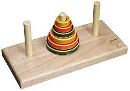
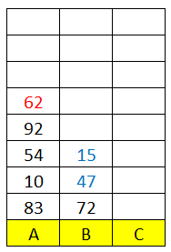

# Pop Sort

Pop Sort merupakan sebuah strategi untuk melakukan penyortiran nilai-nilai dalam array dengan menggunakan strategi Popping Array atau mengeluarkan nilai terakhir satu persatu hingga nilai-nilai dalam array dapat tersusun sesuai dengan keinginan.

Biasanya, pop sort ini disebut dengan **[Tower of Hanoi](https://id.wikipedia.org/wiki/Menara_Hanoi)** karena pendekatan Pop Sort ini mendekati dengan salah satu puzzle buatan Edouard Lucas pada tahun 1883.



Di atas merupakan contoh dari puzzle yang bernama Menara Hanoi, mungkin beberapa di antara kalian akan kembali bernostalgia jaman-jaman masih TK/SD saat melihatnya.

## Persyaratan

Biasanya dalam pertanyaan-pertanyaan interview yang menggunakan pendekatan Tower of Hanoi sebagai soal interviewnya akan menggunakan persyaratan di bawah ini:

1. Untuk perulangan **hanya boleh** menggunakan `for` atau `while` dan tidak boleh menggunakan keduanya.
2. Hanya boleh menggunakan **3 atau 2 array** dalam penggunaannya.

Untuk studi kasus kali ini, kita akan menggunakan aturan `while` loop dan `3 array` secara descending dalam penerapan ini. Sisanya, kalian dapat mengimprovisasinya.

## Teori

Semisalnya saya mempunyai 3 array seperti di bawah ini:


Ingat poin-poin di bawah ini:
- Array A merupakan input dari nilai-nilai yang akan disusun
- Array B merupakan output dari nilai-nilai yang telah disusun
- Array C merupakan tempat penyimpanan sementara

Kira-kira semisal kita buatkan array bentuknya seperti ini:
```php
$a = [83, 10, 54, 92, 62, 47, 15, 72];
$b = [];
$c = [];
```

Kita keluarkan nilai dari Array A paling luar dengan cara Array Pop kemudian kita pindahkan ke B secara berulang-ulang seperti ini:


> Semisalnya nih bang, kalau nilainya lebih gede atau lebih besar dari data yang terakhir masuk gimana tuh bang?

Gud kuesien.

Semisalnya, data sudah seperti ini:



Logikanya, angka `62` pasti lebih besar daripada `47` dan `15`, berarti:
1. Kita harus menyimpan `15` dan `47` ke Array C
2. Bawa angka `62` dari Array A ke Array B agar dapat masuk ke Array B


3. Kita susun balik dari array C ke Array B yang kira-kira bentuknya seperti ini:


Dan seterusnya hingga A benar-benar kosong melompong, kira-kira seperti ini deh bentuk keseluruhannya:


> Udah paham nih om, cepetan contoh kodenya gimana!

Sabar-sabar, untuk penerapan kodenya kita akan bahas di section berikutnya

## Implementasi Kode

Seperti di awal, kita akan menggunakan `while` loop dan `3 array` untuk penerapan kodenya. Tanpa basa-basi langsung kita hantam saja. Untuk filenya, kalian bisa langsung lihat penerapan beserta loggingnya [di sini](./PopSort.php).

```php
public function start(): array
{
    // Registrasi semua arraynya
    $a = $this->array;
    $b = [];
    $c = [];

    // Kita loop hingga data di $a kosong
    while (count($a) != 0) {
        // Keluarkan nilai paling atas dari array $a
        $atasA = array_pop($a);

        // Apabila array B ada isinya dan isi paling atas dari array B
        // lebih kecil dari array A, kita pindahkan semua nilai-nilai yang
        // cocok dengan kondisi tersebut ke array C
        //
        // Pada bagian statement kedua, anda dapat mengganti "<" menjadi ">"
        // sesuai keinginan anda.
        //
        // Catatan:
        // Kita harus menghitung isi array terlebih dahulu sebelum mengambil
        // data array lebih utama agar menghindari error "Undefined index"
        while (count($b) > 0 && $b[count($b) - 1] < $atasA) {
            // Pindahkan data dari $b ke $c
            array_push($c, array_pop($b));
        }

        // Setelah aman, kita masukkan data dari $a ke $b
        array_push($b, $atasA);

        // Apabila isi $c ada, kita balikkan lagi ke $b secara berurutan.
        while (count($c) > 0) {
            array_push($b, array_pop($c));
        }
    }

    // Kembaliin datanya deh
    return $b;
}
```

### Referensi
- GeeksForGeeks. *Python Program for Tower of Hanoi*. [Pranala Luar](https://www.geeksforgeeks.org/python-program-for-tower-of-hanoi/).
- Salman, Nur. Rev. 2020. *Struktur Data: Pengurutan Data di Python*. Makassar: Universitas Dipa Makassar.
- Sedegewick, Robert. dkk. 2015. *Stacks and Queues*. Princeton: Princeton University. [Pranala Luar](https://introcs.cs.princeton.edu/python/43stack/).
